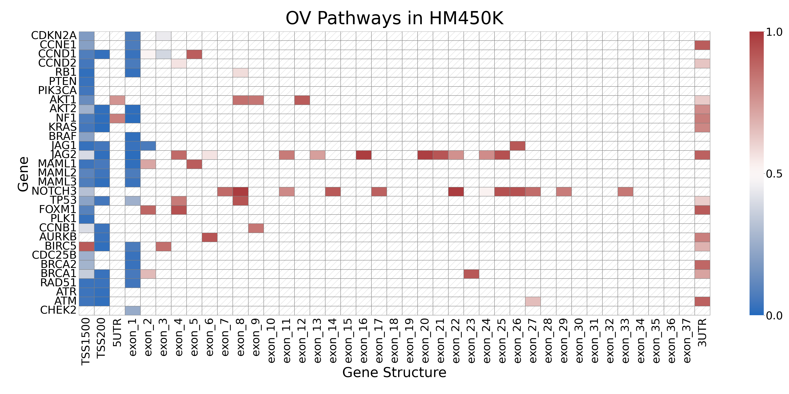

# NormalizeMe

We're developing a computation method to summarize and visualize Illumina Infinium BeadArray-based methylation assay. Here is an example. A cell with diagonal lines means no data. Blue is fully unmethylated, white means half methylated, and red means fully methylated. 

